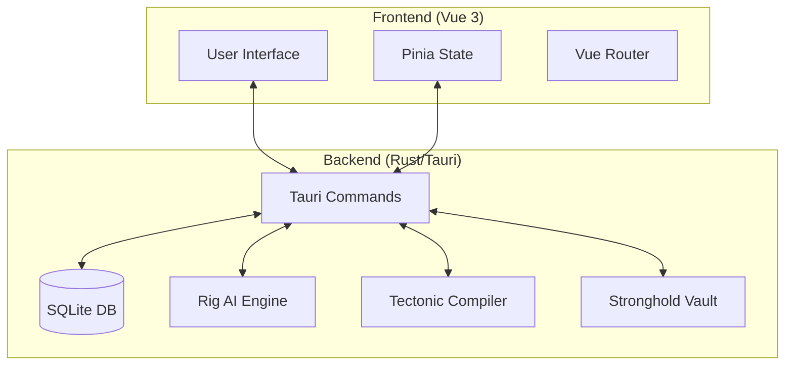

# CSynth 🔬

### Surgical AI Resume Tailoring & LaTeX Orchestration

CSynth
 is a high-performance desktop application designed for professionals who treat their professional narrative as a technical specification. It integrates sovereign LLM orchestration with professional TeX typesetting to ensure your resume is not just tailored, but surgically optimized for every opportunity.

---

## ✨ Features

- **🎯 Precision Tailoring:** LLM-powered analysis of job descriptions to align your experience with specific requirements.
- **🏗️ LaTeX Orchestration:** Real-time compilation of LaTeX source into professional PDFs via the Tectonic engine.
- **🛡️ Secure Credentials:** Military-grade encryption for API keys using AES-256-GCM via Tauri Stronghold.
- **🤖 Multi-Model Support:** Seamless switching between OpenAI, Gemini, Groq, and Anthropic.
- **⚡ Standalone Compiler:** A dedicated workspace for editing and compiling arbitrary LaTeX documents.
- **📂 Application Vault:** Track and manage all your job applications and tailored resumes in one secure location.
- **✨ Premium UI:** A modern, high-fidelity interface with glassmorphism and custom titlebar controls.

---

## 🚀 Getting Started

### For Users
To download the latest stable version of CSynth, visit the **Releases** section:

👉 [**Download CSynth Releases**](https://github.com/AhmedTrooper/CSynth/releases)

---

## 📸 Media & Demos

### Application Interface
*(Insert Screenshot 1: Home Dashboard)*
*(Insert Screenshot 2: AI Tailoring Workspace)*

### Technical Demo
Watch the engine in action:
👉 [**CSynth Technical Demo (YouTube)**](https://www.youtube.com/@AhmedTrooper)

---

## 🛠️ For Developers

We welcome developers to experiment with the CSynth engine. Please follow the instructions below to set up your environment.

### Prerequisites
- [Bun](https://bun.sh/) (Fast JavaScript runtime & package manager)
- [Rust](https://www.rust-lang.org/) (Tauri backend)
- [Tectonic](https://tectonic-typesetting.org/) (Required for PDF compilation)

### Setup & Installation
Please **clone the `dev` branch** for the latest features and patches:

```bash
# Clone the repository
git clone -b dev https://github.com/AhmedTrooper/CSynth.git

# Navigate to the project
cd CSynth

# Install dependencies
bun install

# Run in development mode
bun run tauri dev
```

### Build Instructions
To generate a production-ready binary for your platform:

```bash
bun run tauri build
```

---

## 🗺️ System Architecture

CSynth
 uses a bridge architecture to combine a modern web frontend with a high-performance Rust backend.



---

## 🤝 Contributing

We love contributions! To keep the repository clean and stable, please follow this workflow:

1. **Fork** the repository.
2. Create a **new branch** for your feature or fix (e.g., `feature/awesome-new-logic`).
3. Commit your changes.
4. Push to **your own branch**.
5. Create a **Pull Request (PR)** targeting the `dev` branch.

### Code Quality
- Ensure all TypeScript code passes `vue-tsc --noEmit`.
- Rust code should be formatted with `cargo fmt`.
- Maintain the "Premium" aesthetic in UI contributions.

---

## ⚖️ License

CSynth
 is dual-licensed under the [MIT License](LICENSE) and [Apache License 2.0](LICENSE_APACHE).

---
*Made with ❤️ by [AhmedTrooper](https://github.com/AhmedTrooper)*
